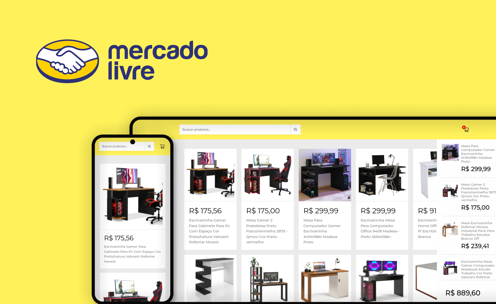

<h1 align="center">Projeto Shopping Cart | React JS</h1>

<h2 align="center">Sobre</h2>

Esse projeto é um app (shopping cart) onde é possível buscar por qualquer produto relacionado e também com a opção de adicionar ao carrinho determinados produtos de sua escolha.

 

  <a href="#-tecnologias">Tecnologias</a>&nbsp;&nbsp;&nbsp;|&nbsp;&nbsp;&nbsp;
  <a href="#-projeto">Projeto</a>&nbsp;&nbsp;&nbsp;|&nbsp;&nbsp;&nbsp;
  <a href="#memo-licença">Licença</a>

  

 

  

## 🚀 Tecnologias

Esse projeto foi desenvolvido com as seguintes tecnologias:

- React JS
- React Icons
- Context API
- [API Mercado Libre](https://api.mercadolibre.com/sites/MLB/search?q=#json)

## 💻 Projeto

- [Visite o projeto online](https://shopping-cart-nine-pi.vercel.app/)

## :memo: Licença

Esse projeto está sob a licença MIT.

---

Developed By Kelviny Mickael.
